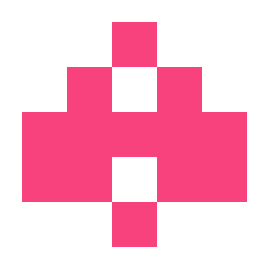
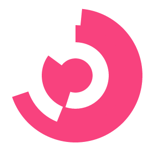

# Identicons
While the GitHub-style identicons are well-designed and widely implemented, they're square. And while this is perfectly acceptable in many designs, variety in choice is never a bad thing. This project aims to apply the simplicity of GitHub identicons to other shapes and styles.

## Use
The identicon files rely on a function named md5() that takes a single input and returns the MD5 hash of the input in the form of a string. This project includes an md5.min.js file with this function (from [this repository](https://github.com/Zunawe/md5-js)).

The minified versions already include the contents of md5.min.js, and may be safely used as a single inclusion.

The functions drawCircularIdenticon() and drawSquareIdenticon take an input to be hashed and draw the identicon into canvas elements named `circularIdenticonCanvas` and `squareIdenticonCanvas` respectively.

The included file index.html gives a small example implementation in HTML.

(The eventual goal is to be able to draw to an arbitrary canvas or to return an SVG of the identicon.)

## Algorithms
Here is a description of the algorithms used to generate each type of identicon. The particular hash function used in this project is MD5 (for its speed broad usability), but the principles can be applied to any reasonable hashing function for strings. The hashed data will be referred to as `hash`, and will be considered an array of bytes where `hash[0]` is the least significant byte and `hash[15]` is the most significant byte.

### Square


Following the style of our friends at GitHub, this creates a 5x5 grid of pixels.

1. The size of a pixel is determined to be 1/6th (rounded down) the dimensions of the canvas size (which is square).
2. Each margin is 1/12th the dimensions of the canvas plus the amount truncated from the calculation of the pixel size.
3. Color is determined by hexadecimal RGB with `hash[13]`, `hash[14]`, and `hash[15]` as values respectively.
4. From low- to high-order bits, and from left to right and top to bottom, the bit determines whether a pixel in the grid is opaque or transparent. This is calculated for the first three pixels of each row and then mirrored to the other side. Bit four corresponds to the second row, first pixel.

### Circular


This style creates a circular icon with so many partially filled rings.

1. The innermost ring (the filled circle) has radius `r = (size / ((num_shells * 2) + 1))`.
2. The nth ring moving outward from the center has radius `n * r` (`n = 0` is the innermost ring).
3. Color is determined by hexadecimal RGB with `hash[13]`, `hash[14]`, and `hash[15]` as values respectively.
4. The innermost ring is a filled circle with radius `r` for every identicon.
5. Starting from the inside and moving outward, the nth arc is drawn with inner radius `n * r` and outer radius `(n + 1) * r`. Calculations are done in polar coordinates.
  * Two angles are calculated:
    * ```theta1 = 2\pi * (hash[(n * 2) + 0] / 0xFF)```
    * ```theta2 = 2\pi * (hash[(n * 2) + 1] / 0xFF)```
  * The arc is drawn from smaller angle to bigger angle.
  * Each ring has exactly 1 arc in it.
